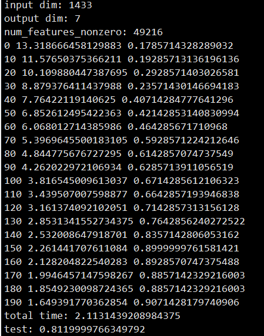
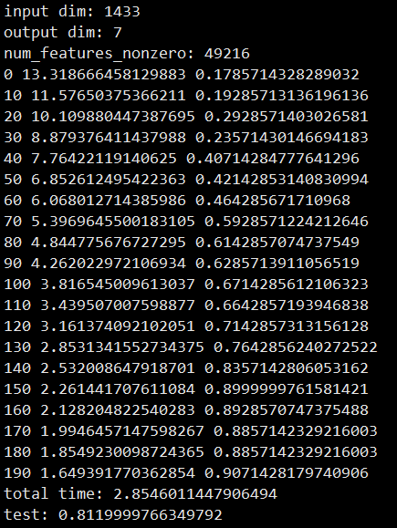

# Graph Convolution Network for PyTorch

Pytorch >= 1.0 with python 3.7.

GCN implementation for paper: [Semi-Supervised Classification with Graph Convolutional Networks](https://arxiv.org/pdf/1609.02907.pdf)

For pipelined GNN training, here is a related work (in MLSys-GNNSys21): [Analyzing the Performance of Graph Neural Networks with Pipe Parallelism](https://gnnsys.github.io/papers/GNNSys21_paper_12.pdf)

# Benchmark

| dataset       | Citeseea | Cora | Pubmed | NELL |
|---------------|----------|------|--------|------|
| GCN(official) | 70.3     | 81.5 | 79.0   | 66.0 |
| This repo.    |          | 81.7 |   78.7  |      |

Hints:
To achieve 81.7% on `Cora` dataset, pytorch need 400 epochs and it train relatively slower on `Pubmed` dataset.


# HOWTO
```sh
python train.py
python pipe_train.py
```

# Screenshot




